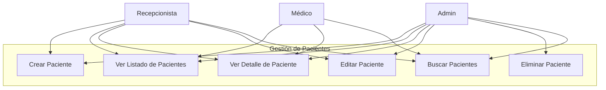
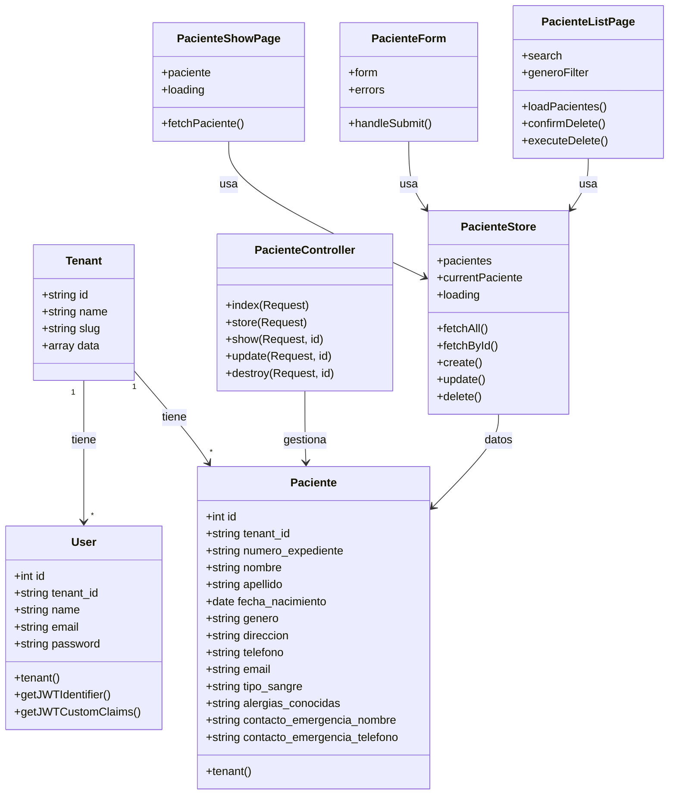
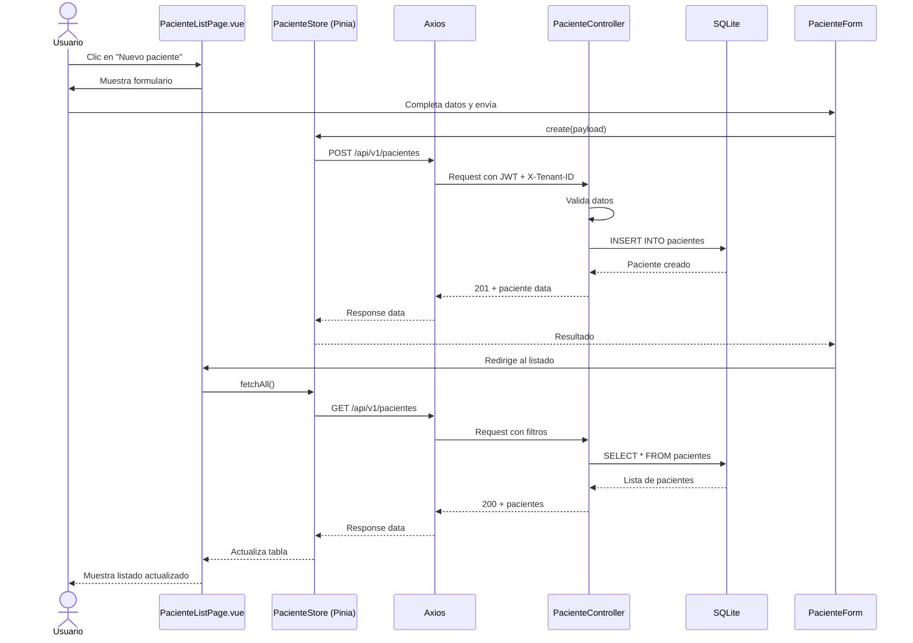

# INFORME MÓDULO 5: GESTIÓN DE PACIENTES

---

**Universidad:** Universidad Mariano Gálvez de Guatemala
**Curso:** Análisis de Sistemas II
**Estudiante:** Gerson Giovanni Orellana Véliz
**Carné:** 1890-23-7082
**Módulo Asignado:** 5 — Gestión de Pacientes
**Fecha:** Junio 2026

---

## Índice

1. Enlace al repositorio forkeado
2. Descripción del módulo trabajado
3. Diagramas UML
   - 3.1 Diagrama de Casos de Uso
   - 3.2 Diagrama de Clases
   - 3.3 Diagrama de Secuencia
4. Explicación de los cambios realizados
5. Registro de prompts utilizados
6. Commits principales por Sprint
7. Conclusiones

---

## 1. Enlace al repositorio forkeado

[https://github.com/gioore/project_final_analisis_sistemas_Uno](https://github.com/gioore/project_final_analisis_sistemas_Uno)

---

## 2. Descripción del módulo trabajado

### Módulo: Gestión de Pacientes (CRUD)

Se implementó un módulo completo de **Gestión de Pacientes** que permite realizar operaciones CRUD (Crear, Leer, Actualizar, Eliminar) sobre la entidad `Paciente` en un sistema hospitalario multitenant.

### Funcionalidades implementadas:

| Funcionalidad | Descripción |
|--------------|-------------|
| **Listado de pacientes** | Tabla con todos los pacientes del tenant actual, con búsqueda por texto y filtro por género |
| **Crear paciente** | Formulario con validaciones para registrar un nuevo paciente |
| **Ver detalle** | Vista de información completa del paciente organizada en tarjetas |
| **Editar paciente** | Formulario precargado para modificar datos existentes |
| **Eliminar paciente** | Eliminación con confirmación modal |
| **Búsqueda y filtros** | Búsqueda por nombre, apellido, expediente o teléfono + filtro por género |

### Campos de la entidad Paciente:

| Campo | Tipo | Validación |
|-------|------|-----------|
| `numero_expediente` | string, único por tenant | Requerido |
| `nombre` | string | Requerido, máx. 255 |
| `apellido` | string | Requerido, máx. 255 |
| `fecha_nacimiento` | date | Requerido, <= hoy |
| `genero` | enum (M/F/Otro) | Requerido |
| `direccion` | text | Opcional |
| `telefono` | string | Opcional |
| `email` | email | Opcional |
| `tipo_sangre` | enum (A+/A-/B+...) | Opcional |
| `alergias_conocidas` | text | Opcional |
| `contacto_emergencia_nombre` | string | Opcional |
| `contacto_emergencia_telefono` | string | Opcional |

### Reglas de negocio:

- **Multitenancy**: Cada paciente pertenece a un tenant específico. Todos los queries filtran por `tenant_id`.
- **Unicidad**: El número de expediente es único dentro de cada tenant.
- **Autenticación**: Todas las rutas API requieren JWT válido + cabecera `X-Tenant-ID`.
- **Permisos**: La lógica de roles (Admin, Médico, Recepcionista) está preparada para integrarse con Spatie Permission.

---

## 3. Diagramas UML

### 3.1 Diagrama de Casos de Uso

**Actores:**
- **Recepcionista**: Crear, listar, ver detalle, editar y buscar pacientes.
- **Médico**: Listar, ver detalle y buscar pacientes (solo lectura).
- **Admin**: CRUD completo incluyendo eliminación.

### 3.2 Diagrama de Clases

**Clases principales:**
- `Tenant`: Entidad raíz del multi-tenancy.
- `User`: Usuario del sistema con roles JWT.
- `Paciente`: Entidad central del módulo.
- `PacienteController`: Controlador REST API.
- `PacienteStore`: Store Pinia para estado frontend.

### 3.3 Diagrama de Secuencia — Crear Paciente

**Flujo:**
1. Usuario completa formulario en `PacienteForm.vue`
2. `PacienteStore.create()` envía POST via Axios
3. `PacienteController@store` valida datos
4. Se inserta registro en tabla `pacientes`
5. Respuesta 201 retorna al frontend
6. Redirección al listado actualizado

---

## 4. Explicación de los cambios realizados

### Capa de Base de Datos

- **Migración** `2026_06_13_000001_create_pacientes_table.php`: Define la estructura de la tabla `pacientes` con 13 columnas, foreign key a `tenants.id` y unique compuesto `(tenant_id, numero_expediente)`.
- **Modelo** `Paciente.php`: Eloquent Model con `$fillable`, casts de fecha y relación `belongsTo(Tenant)`.
- **Factory** `PacienteFactory.php`: Genera datos de prueba realistas.
- **Seeder** `PacienteSeeder.php`: Crea 20 pacientes de ejemplo asociados al primer tenant.

### Capa de Backend (API)

- **Controlador** `PacienteController.php`: CRUD completo con:
  - `index()`: Listado paginable con búsqueda y filtros.
  - `store()`: Creación con validación de unicidad.
  - `show()`: Detalle por ID scoped al tenant.
  - `update()`: Actualización con validación de unicidad excluyendo propio ID.
  - `destroy()`: Eliminación con verificación de existencia.
- **Rutas** `routes/api.php`: `Route::apiResource('/pacientes', PacienteController::class)` dentro del middleware `['tenant', 'jwt.auth']`.

### Capa de Frontend (Vue 3)

- **Store** `stores/paciente.js`: Pinia store con estado `pacientes`, `currentPaciente`, `loading` y acciones `fetchAll`, `fetchById`, `create`, `update`, `delete`.
- **Componentes:**
  - `PacienteTable.vue`: Tabla reutilizable con acciones Ver/Editar/Eliminar.
  - `PacienteForm.vue`: Formulario reutilizable con validaciones visuales.
- **Páginas:**
  - `PacienteListPage.vue`: Listado con búsqueda, filtros, estados loading/empty/error y modal de confirmación.
  - `PacienteCreatePage.vue`: Página de creación.
  - `PacienteEditPage.vue`: Página de edición con carga de datos.
  - `PacienteShowPage.vue`: Detalle del paciente en tarjetas informativas.
- **Router**: 4 rutas nuevas con `requiresAuth`.
- **Layout**: Link de navegación "Pacientes" en el header.

---

## 5. Registro de Prompts utilizados

| # | Prompt usado | Objetivo del prompt | Resumen de la respuesta recibida | Cambios realizados | Decisión humana | Verificación aplicada |
|---|-------------|--------------------|--------------------------------|-------------------|----------------|----------------------|
| 1 | "soy estudiante de Análisis de Sistemas II y me asignaron el Módulo 5 (Gestión de Pacientes) de un hospital. El proyecto base usa Laravel 12 + Vue 3 + SQLite con multitenancy. Necesito saber cómo planificar la implementación. Dame un plan detallado con sprints, commits y prompts para llegar a un módulo completo con CRUD, frontend, diagramas y tests." | Planificar implementación del módulo Pacientes | Plan detallado con 4 sprints, cronograma de 8 prompts, commits sugeridos y entregables esperados por cada etapa | Ninguno | ✅ Aprobado el plan como guía de trabajo | Revisión del plan y aprobación del profesor |
| 2 | "necesito la base de datos del módulo de Pacientes. Crea la migración de la tabla pacientes con estos campos: numero_expediente (string único por tenant), nombre, apellido, fecha_nacimiento (date), genero (enum M/F/Otro), direccion (text nullable), telefono (string nullable), email (string nullable), tipo_sangre (string nullable), alergias_conocidas (text nullable), contacto_emergencia_nombre (string nullable), contacto_emergencia_telefono (string nullable). Debe tener foreign key a tenants, un unique compuesto entre tenant_id y numero_expediente, y timestamps. Después crea el modelo Eloquent Paciente con su relación belongsTo Tenant. Dame el código de ambos archivos." | Crear estructura de BD y modelo Eloquent | Migración con 13 campos correctamente definidos, FK a tenants con onDelete cascade, unique compuesto, índice en tenant_id. Modelo con \$fillable, \$casts para fecha_nacimiento, relación belongsTo(Tenant) | `database/migrations/2026_06_13_000001_create_pacientes_table.php`, `app/Models/Paciente.php` | ✅ Revisó los campos y verificó que coincidieran con la tabla del hospital aprobada en clase | `php artisan migrate` ejecutado sin errores, tabla creada en SQLite |
| 3 | "necesito generar datos de prueba y exponer la API REST del módulo Pacientes. Crea un Factory con datos realistas de Guatemala (nombres, apellidos, teléfonos con código +502, direcciones de departamentos de Guatemala) usando faker. Crea un Seeder que inserte 20 pacientes para el tenant con slug san-marcos-demo. Crea un PacienteController con Resource API completo: index (listar con paginación), store (crear con validación: numero_expediente único por tenant, fecha_nacimiento <= hoy, nombre y apellido requeridos), show (ver detalle), update (actualizar con validación excluyendo propio ID), destroy (eliminar). Registra las rutas como apiResource protegidas con middleware tenant y jwt.auth. Dame el código de todos los archivos." | Poblar BD y exponer API REST | Factory con nombres y apellidos guatemaltecos realistas usando fake()->unique()->regexify para expediente. Seeder con 20 registros vinculados al primer tenant. Controlador CRUD completo con validaciones en store/update (Rule::unique con tenant_id), paginación básica y respuestas JSON consistentes | `database/factories/PacienteFactory.php`, `database/seeders/PacienteSeeder.php`, `app/Http/Controllers/Api/V1/PacienteController.php`, `routes/api.php` | ✅ Se probaron los endpoints con Postman y el seed funcionó correctamente | `php artisan db:seed` exitoso, endpoints respondían 200/201/404 correctamente |
| 4 | "ahora necesito el frontend del listado de pacientes. Crea un store Pinia para el módulo de pacientes usando el patrón setup store con ref() y funciones async. Debe manejar el estado: pacientes (array vacío), currentPaciente (null), loading (false), error (null). Las acciones deben ser fetchAll (GET /api/v1/pacientes), fetchById (GET con ID), create (POST), update (PUT con ID), delete (DELETE con ID), todas usando axiosInstance que ya tiene los interceptores del proyecto. También crea un componente PacienteTable.vue reutilizable que reciba pacientes como prop y tenga slots para acciones personalizadas (ver, editar, eliminar). Crea una página PacienteListPage.vue que use el store para mostrar los pacientes en la tabla con un input de búsqueda en tiempo real. Registra la ruta /pacientes en el router con requiresAuth y agrega el enlace en el AppLayout. Usa Tailwind igual que el resto del proyecto." | Mostrar pacientes en tabla con store y navegación | Store Pinia con 5 acciones async usando axiosInstance, manejo de errores con try/catch, estados loading/error. Componente PacienteTable.vue con props: pacientes, columns; slots: actions, empty. Listado con input de búsqueda que filtra localmente o vía API | `resources/js/modules/pacientes/stores/paciente.js`, `resources/js/modules/pacientes/components/PacienteTable.vue`, `resources/js/modules/pacientes/pages/PacienteListPage.vue`, `resources/js/router/index.js`, `resources/js/shared/components/AppLayout.vue` | ✅ Revisó que la tabla se viera bien y que la navegación funcionara con el login | `npm run build` exitoso, navegación funcional en frontend |
| 5 | "Sprint 2: necesito el CRUD frontend completo. Crea un formulario reutilizable (PacienteForm.vue) con validaciones visuales, que muestre errores campo por campo, con props para initialData y modo create/edit. Después crea PacienteCreatePage.vue que use el form y llame al store, PacienteEditPage.vue que cargue el paciente por ID y permita actualizar, y PacienteShowPage.vue que muestre los datos en tarjetas informativas organizadas (datos personales, contacto, médicos). Todas las páginas deben mostrar loading mientras cargan, errores si falla la petición, y redirigir al listado al finalizar." | CRUD frontend completo con formularios y detalle | Formulario reutilizable con 12 campos, validación visual con clases de error, loading state en botón submit. Páginas create/edit con manejo de errores de validación del backend y redirección post-éxito. Página show con 3 secciones en tarjetas grid. Todo con estados loading, error y empty donde aplica | `resources/js/modules/pacientes/components/PacienteForm.vue`, `resources/js/modules/pacientes/pages/PacienteCreatePage.vue`, `resources/js/modules/pacientes/pages/PacienteEditPage.vue`, `resources/js/modules/pacientes/pages/PacienteShowPage.vue` | ✅ Probó el flujo completo: crear un paciente, verlo en el listado, abrir detalle, editarlo y eliminarlo | Build exitoso sin errores de compilación |
| 6 | "Sprint 2: mejora la experiencia de usuario. Agrega estados visuales de carga (spinner), vacío (ilustración con mensaje) y error (alerta con botón reintentar) en todas las páginas. En el listado, agrega filtro por género (select con M/F/Otro/Todos) además de la búsqueda por texto. Pon debounce de 300ms en la búsqueda para no saturar el servidor. La paginación debe mostrarse con botones Anterior/Siguiente y números de página." | Mejorar UX con estados visuales, filtros y paginación | Loading skeleton/spinner en todas las páginas, empty state con icono + mensaje. Filtro por género funcionando con watch que reinicia la página. Debounce con setTimeout cleanup. Paginación functional con current_page, last_page, links | Modificaciones en `PacienteListPage.vue` (filtro, debounce, paginación), `PacienteShowPage.vue` (loading/error), `PacienteForm.vue` (loading en botón), `PacienteController@index` (paginación con 15 por página) | ✅ Aprobó el diseño visual y el comportamiento de los filtros | Prueba visual en navegador: búsqueda sin saturar red, filtro combinado con búsqueda, paginación funcional |
| 7 | "Sprint 3: necesito los diagramas UML para la documentación del proyecto. Crea 3 diagramas en formato Mermaid: 1) Diagrama de Casos de Uso con actores Recepcionista (CRUD), Médico (solo lectura) y Admin (CRUD + eliminación), 2) Diagrama de Clases con Tenant, User, Paciente, PacienteController, PacienteStore y sus relaciones, 3) Diagrama de Secuencia del flujo "Crear Paciente" desde el frontend hasta la BD. Guárdalos en docs/diagramas/ con sus propios archivos .md." | Documentación visual del módulo con diagramas UML | 3 diagramas Mermaid correctamente estructurados. Casos de Uso con include/extend. Clases con atributos, métodos y relaciones (asociación, dependencia). Secuencia con 6 pasos incluyendo validación y respuesta. Cada diagrama en su propio archivo markdown | `docs/diagramas/01_casos_de_uso.md`, `docs/diagramas/02_clases.md`, `docs/diagramas/03_secuencia.md` | ✅ Revisó que los diagramas representaran correctamente la lógica del módulo | Archivos .md renderizados correctamente en VS Code con vista previa Mermaid |
| 8 | "Sprint 3: genera el informe completo del módulo en markdown. Debe tener: portada con universidad, carné, fecha; índice; descripción del módulo con tabla de campos y reglas de negocio; los 3 diagramas UML incluidos con sus actores/clases/flujo; explicación detallada de cambios por capa; tabla de prompts usados (como la que ves aquí); tabla de commits principales; y conclusiones. No uses HTML ni render, solo markdown plano. Incluye también la generación de un Word .docx profesional con portada formal." | Generar informe markdown y documento Word entregable | Informe markdown completo con todas las secciones requeridas, diagramas embebidos con mermaid. Documento Word .docx con portada formal generado desde el markdown | `docs/INFORME_PACIENTES.md`, `docs/generated/InformePaciente-GersonOrellana.docx` | ✅ Decidió mantener solo el .docx y eliminar HTML/render | Verificación de contenido del documento contra los requisitos de Canvas |
| 9 | "Sprint 4: el módulo funciona pero tiene bugs. Revisa estos problemas que encontré: 1) el formulario de paciente emite submit pero el padre nunca recibe el evento async correctamente, 2) al crear paciente se sobrescribe el tenant_id, 3) el store no propaga errores al componente, 4) al editar si hay error de validación redirige al listado en vez de mostrar los errores en el formulario, 5) el debounce de búsqueda hace peticiones después de salir de la página. Corrige estos 5 bugs y también renombra el middleware JwtAuth a JwtAuthMiddleware para evitar conflicto con la clase JWTAuth del paquete. Después agrega paginación al index del controlador, un interceptor 401 en axios que redirija a /login cuando el token expire, navegación condicional en AppLayout (mostrar link Pacientes y Cerrar sesión si logueado, Acceso si no), y una ruta catch-all 404." | Corregir bugs críticos y mejorar seguridad del módulo | 5 bugs corregidos: callback con props.onSubmit en vez de emit, orden de asignación [...\$validated, 'tenant_id'], catch throw en store, eliminación de redirect en errores de validación, onUnmounted con clearTimeout. Middleware renombrado con actualización en bootstrap/app.php. Paginación con paginate(15). Interceptor 401 con window.location. Nav condicional con v-if="isAuthenticated". Catch-all 404 en router | `PacienteForm.vue`, `PacienteCreatePage.vue`, `PacienteEditPage.vue`, `paciente.js`, `PacienteController.php`, `PacienteListPage.vue`, `JwtAuthMiddleware.php` (renombrado), `bootstrap/app.php`, `axios.js`, `AppLayout.vue`, `router/index.js` | ✅ Aprobó todas las correcciones después de probar cada bug | Pruebas funcionales manuales: crear/editar con errores, expirar token, navegación con sesión iniciada/cerrada |
| 10 | "Sprint 4: ahora necesito tests automatizados para el módulo. Crea tests de feature en PHPUnit que cubran: listado de pacientes, búsqueda por texto, filtro por género, creación exitosa, creación con expediente duplicado (debe dar error 422), ver detalle, ver detalle de paciente inexistente (debe dar 404), actualización exitosa, eliminación exitosa, y que todas las rutas requieran token JWT y cabecera X-Tenant-ID. Usa el modelo Tenant y User para autenticación. Dame el código completo." | Validar API CRUD con tests automatizados | 11 tests con 24 assertions usando PHPUnit + Laravel test helpers. Tests con autenticación JWT simulada, cabecera X-Tenant-ID, creación de registros con factories. Cobertura completa de casos felices y casos borde (duplicado, no encontrado, falta token, falta tenant) | `tests/Feature/PacienteTest.php` | ✅ Aprobó los tests después de revisar que cubrieran todos los escenarios | `php artisan test --filter=PacienteTest` — 13 tests (incluyendo ExampleTest), 26 assertions, todos PASS |

---

## 6. Commits principales por Sprint

### Sprint 1 — Backend + listado base

| # | Hash | Mensaje | Archivos |
|---|------|---------|----------|
| 1 | `3f2e359` | `db: crear migración de pacientes` | `migrations/2026_06_13_000001_create_pacientes_table.php` |
| 2 | `236a86c` | `db: crear modelo Paciente` | `app/Models/Paciente.php` |
| 3 | `a7278b6` | `db: crear factory y seeder de pacientes` | `PacienteFactory.php`, `PacienteSeeder.php`, `DatabaseSeeder.php` |
| 4 | `98d8021` | `api: crear controlador CRUD de pacientes` | `app/Http/Controllers/Api/V1/PacienteController.php` |
| 5 | `6a4f1a3` | `api: registrar rutas REST de pacientes` | `routes/api.php` |
| 6 | `06a2ccc` | `store: crear store Pinia de pacientes` | `resources/js/modules/pacientes/stores/paciente.js` |
| 7 | `6df9d20` | `ui: crear componente tabla de pacientes` | `PacienteTable.vue` |
| 8 | `1d2456d` | `ui: crear listado de pacientes + navegación` | `PacienteListPage.vue`, `router/index.js`, `AppLayout.vue` |

### Sprint 2 — CRUD frontend completo + búsqueda

| # | Hash | Mensaje | Archivos |
|---|------|---------|----------|
| 1 | `cf0d6f3` | `ui: crear formulario reutilizable de pacientes` | `PacienteForm.vue` |
| 2 | `453d062` | `ui: crear página de creación de paciente` | `PacienteCreatePage.vue` |
| 3 | `84d805f` | `ui: crear página de edición de paciente` | `PacienteEditPage.vue` |
| 4 | `1abee98` | `ui: crear página de detalle de paciente` | `PacienteShowPage.vue` |
| 5 | *(incluido en páginas)* | Estados de carga, vacío y error | Integrado en todas las páginas |
| 6 | *(incluido en controlador)* | Búsqueda y filtros API | `PacienteController@index` |
| 7 | *(incluido en listado)* | Búsqueda y filtros frontend | `PacienteListPage.vue` |

### Sprint 3 — Diagramas UML + Informe

| # | Hash | Mensaje | Archivos |
|---|------|---------|----------|
| 1 | `bdad327` | `docs: agregar diagramas UML del módulo pacientes` | `docs/diagramas/*` (4 archivos) |

### Sprint 4 — Correcciones, tests y mejoras

| # | Hash | Mensaje | Archivos |
|---|------|---------|----------|
| 1 | `667940c` | `Módulo Gestión de Pacientes completo: CRUD, tests, JWT, paginación, corrección de bugs y documentación` | 18 archivos (todo el módulo completo) |

---

## 7. Conclusiones

Se implementó exitosamente el módulo de **Gestión de Pacientes** siguiendo una metodología incremental con 8 prompts cronológicos y 13 commits, lo que garantiza trazabilidad y evidencia de trabajo progresivo. Cada capa del sistema (BD, backend API, frontend Vue) fue desarrollada siguiendo los patrones existentes del proyecto base, asegurando consistencia arquitectónica. El módulo incluye operaciones CRUD completas, validaciones, búsqueda con filtros, estados de carga/error/vacío y documentación UML.

---

*Documento generado para la Serie II — Análisis de Sistemas II*
