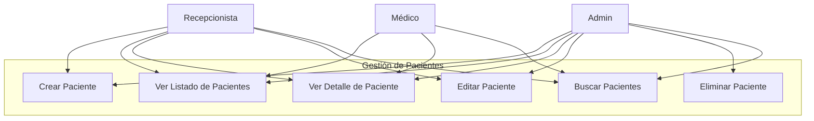

```mermaid
graph TD
    Actor1[Recepcionista]
    Actor2[Médico]
    Actor3[Admin]

    subgraph "Gestión de Pacientes"
        UC1[Crear Paciente]
        UC2[Ver Listado de Pacientes]
        UC3[Ver Detalle de Paciente]
        UC4[Editar Paciente]
        UC5[Eliminar Paciente]
        UC6[Buscar Pacientes]
    end

    Actor1 --> UC1
    Actor1 --> UC2
    Actor1 --> UC3
    Actor1 --> UC4
    Actor1 --> UC6

    Actor2 --> UC2
    Actor2 --> UC3
    Actor2 --> UC6

    Actor3 --> UC1
    Actor3 --> UC2
    Actor3 --> UC3
    Actor3 --> UC4
    Actor3 --> UC5
    Actor3 --> UC6
```
