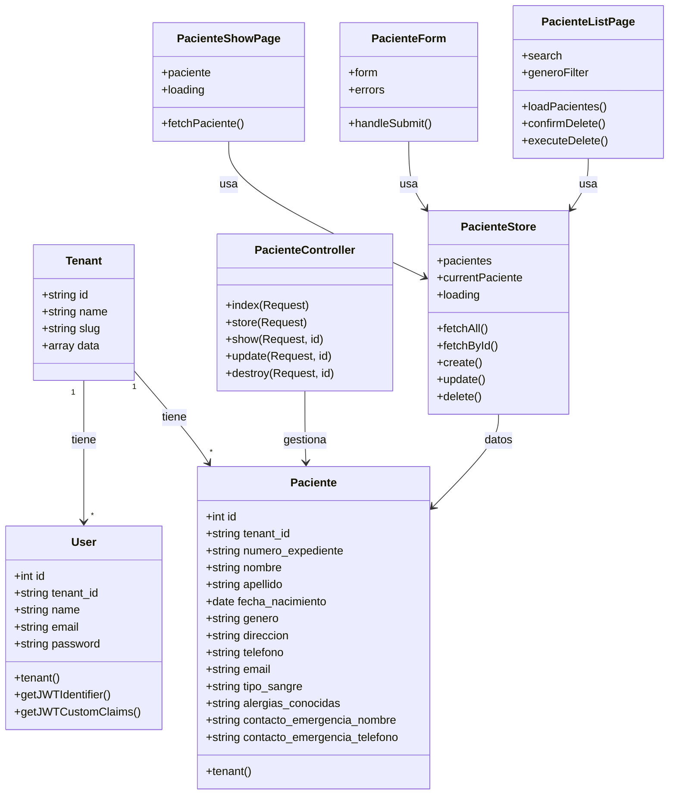

```mermaid
classDiagram
    class Tenant {
        +string id
        +string name
        +string slug
        +array data
    }

    class User {
        +int id
        +string tenant_id
        +string name
        +string email
        +string password
        +tenant()
        +getJWTIdentifier()
        +getJWTCustomClaims()
    }

    class Paciente {
        +int id
        +string tenant_id
        +string numero_expediente
        +string nombre
        +string apellido
        +date fecha_nacimiento
        +string genero
        +string direccion
        +string telefono
        +string email
        +string tipo_sangre
        +string alergias_conocidas
        +string contacto_emergencia_nombre
        +string contacto_emergencia_telefono
        +tenant()
    }

    class PacienteController {
        +index(Request)
        +store(Request)
        +show(Request, id)
        +update(Request, id)
        +destroy(Request, id)
    }

    class PacienteListPage {
        +search
        +generoFilter
        +loadPacientes()
        +confirmDelete()
        +executeDelete()
    }

    class PacienteForm {
        +form
        +errors
        +handleSubmit()
    }

    class PacienteShowPage {
        +paciente
        +loading
        +fetchPaciente()
    }

    class PacienteStore {
        +pacientes
        +currentPaciente
        +loading
        +fetchAll()
        +fetchById()
        +create()
        +update()
        +delete()
    }

    Tenant "1" --> "*" Paciente : tiene
    Tenant "1" --> "*" User : tiene
    PacienteController --> Paciente : gestiona
    PacienteStore --> Paciente : datos
    PacienteListPage --> PacienteStore : usa
    PacienteForm --> PacienteStore : usa
    PacienteShowPage --> PacienteStore : usa
```
