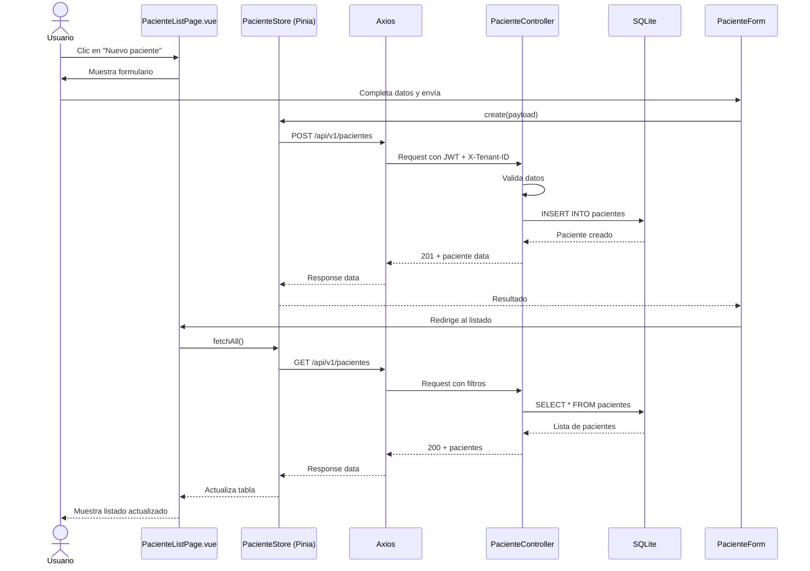

```mermaid
sequenceDiagram
    actor Usuario
    participant ListPage as PacienteListPage.vue
    participant Store as PacienteStore (Pinia)
    participant API as Axios
    participant Backend as PacienteController
    participant DB as SQLite

    Usuario->>ListPage: Clic en "Nuevo paciente"
    ListPage->>Usuario: Muestra formulario
    Usuario->>PacienteForm: Completa datos y envía
    PacienteForm->>Store: create(payload)
    Store->>API: POST /api/v1/pacientes
    API->>Backend: Request con JWT + X-Tenant-ID
    Backend->>Backend: Valida datos
    Backend->>DB: INSERT INTO pacientes
    DB-->>Backend: Paciente creado
    Backend-->>API: 201 + paciente data
    API-->>Store: Response data
    Store-->>PacienteForm: Resultado
    PacienteForm->>ListPage: Redirige al listado
    ListPage->>Store: fetchAll()
    Store->>API: GET /api/v1/pacientes
    API->>Backend: Request con filtros
    Backend->>DB: SELECT * FROM pacientes
    DB-->>Backend: Lista de pacientes
    Backend-->>API: 200 + pacientes
    API-->>Store: Response data
    Store-->>ListPage: Actualiza tabla
    ListPage-->>Usuario: Muestra listado actualizado
```
